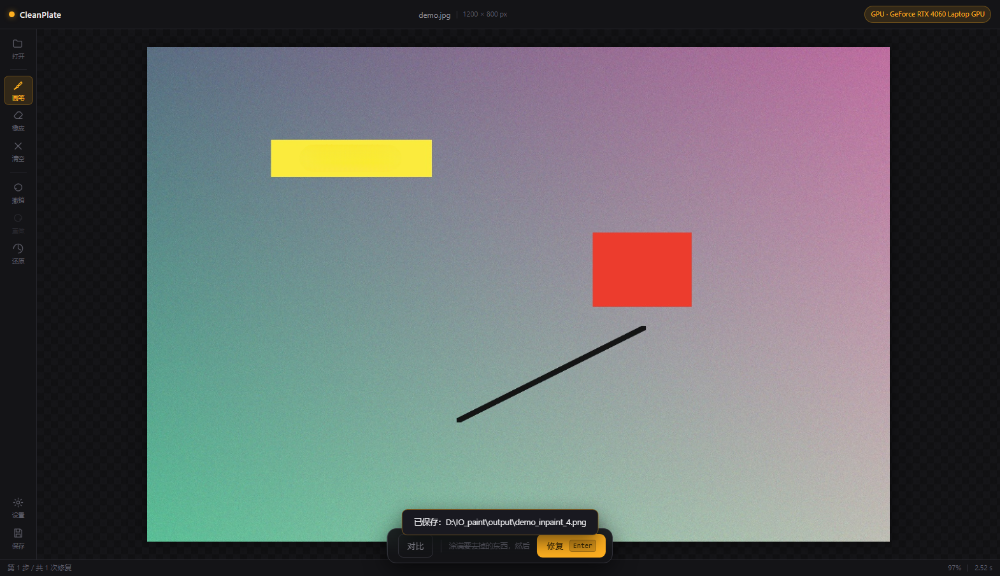

# CleanPlate

本地 AI 去杂物工具。涂掉照片里不想要的东西 —— 路人、电线、垃圾桶、水印、瑕疵 —— 让模型把背景补回来。

**照片全程不出本机**，不需要联网（只有第一次下模型要联网）。



`v0.03` · MIT 许可 · Python + PyTorch · 只监听 `127.0.0.1`

> **v0.03** 新增**智能选区**：磁性套索（`L`）、粗框自动收缩（`K`）、魔棒（`W`）——
> 三种交互共用一个边缘检测内核，零依赖。核心思路是**把要补的面积掐到最小**：
> 洞越小，LaMa 补得越好。详见 [「智能选区」](#智能选区)。

基于 [IOPaint](https://github.com/Sanster/IOPaint)（Apache-2.0）的 LaMa 模型，推理逻辑照搬自它的 `iopaint/model/lama.py`，但去掉了 Gradio / diffusers / transformers 那一大堆依赖，只留最必要的部分。代码短、跑得快、方便自己改。

---

## 一、快速开始

### 已经在用的话

```
双击  启动.bat
```

### 从零开始

**第 1 步 · 装依赖**（只做一次，约 2.5 GB，10~30 分钟）

```
双击  scripts\setup.bat
```

没有 NVIDIA 显卡、或者想先轻量试一下：

```
scripts\setup.bat cpu
```

**第 2 步 · 启动**

```
双击  scripts\run.bat
```

浏览器会自动打开 `http://127.0.0.1:8240`。首次启动会后台下载 LaMa 模型（约 200 MB），顶栏会显示进度；下完就能用。

### 在 VSCode 里

用 VSCode 打开本目录，然后：

| 操作 | 作用 |
|---|---|
| `F5` | 启动界面（调试模式，能打断点） |
| `Ctrl+Shift+B` | 跑默认任务（首次安装依赖） |
| 命令面板 → `Tasks: Run Task` | 启动界面 / 下载模型 / 查看设备状态 |

调试配置在 `.vscode/launch.json` 里，另有两个现成的：
- **强制用 CPU 跑** —— 排查显卡问题用
- **下载 LaMa 模型** —— 单独跑下载

---

## 二、界面怎么用

```
┌──────────────────────────────────────────────────────┐
│  ● CleanPlate          IMG_2043.jpg · 6000×4000      │  ← 顶栏
├────┬─────────────────────────────────────────────────┤
│ 打 │                                                 │
│ 开 │                                                 │
│    │                                                 │
│ 画 │              照片显示在这里                       │
│ 笔 │              涂过的地方显示为琥珀色               │
│ 橡 │                                                 │
│ 皮 │                                                 │
│    │                                                 │
│ 套 │                                                 │
│ 索 │                                                 │
│ 框 │                                                 │
│ 选 │                                                 │
│ 魔 │                                                 │
│ 棒 │                                                 │
│    │                                                 │
│ 撤 │                                                 │
│ 销 │          ┌────────────────────────┐             │
│ 还 │          │  对比   │  ⌘ 修复 Enter │             │  ← 底部操作条
│ 原 │          └────────────────────────┘             │
│ 设 │                                                 │
│ 保 │                                                 │
│ 存 │                                                 │
└────┴─────────────────────────────────────────────────┘
```

**流程就三步：选 → 修复 → 满意就保存。**

1. 拖一张照片进窗口 / 点左侧「打开」浏览本地目录 / 直接 `Ctrl+V` 粘贴
2. 把要去掉的东西选出来 —— 手涂就用画笔（**涂大一点没关系**，涂不干净才会留残影）；
   也可以用「智能选区」里的三种工具让程序帮你贴边（见下一节）
3. 按 `Enter` 或点「修复」
4. 不满意就 `Ctrl+Z` 撤销，或者调一下「边缘外扩」再来一次
5. 点「对比」看前后差异（可拖动中间的分割线）
6. 点「保存」

### 智能选区

除了手涂，还有三种「让程序自己找边界」的选法。**三种共用同一张边缘图**：
程序先把照片算成一张「哪里是边」的图，之后无论是吸附、收缩还是扩展，都往边缘上靠。
所以选出来的边界比手涂干净，而且要补的面积更小。

| 工具 | 快捷键 | 怎么用 | 适合 |
|---|---|---|---|
| **磁性套索** | `L` | 沿着物体边缘拖动，回到起点自动闭合 | 形状不规则、边缘清楚的物体 |
| **粗框收缩** | `K` | 随手框一块，松手自动收缩到框里的物体轮廓 | 懒得描边，先框个大范围 |
| **魔棒** | `W` | 点一下，自动选中颜色相近的一整片 | 纯色背景（天空、墙面）、规则色块 |

左栏底部点「设置」，参数会跟着当前工具换：

- **吸附半径** —— 套索拖动时，在多远的范围内找边缘。边缘虚焦、对比低就调大
- **魔棒容差** —— 多大色差算「同一片」。调小只选纯色，调大能容忍渐变

> **为什么值得用**：LaMa 补出来的质量跟**要补的面积**强相关 —— 洞越大，
> 它越只能顺着边界平缓地内插。用选区把范围掐准，等于把问题从
> 「让模型猜」变成「模型只补一点点」，效果提升比调任何参数都明显。

> 这三种都是传统算法（Sobel 梯度 + 区域生长），零依赖、几百行、不需要额外权重。
> 对「边缘清晰」的常见场景够用；以后要接分割模型也不需要改前端架构。

### 选片

点左侧「打开」，或 `Ctrl+O`，会打开选片窗口。窗口分左右两块：**左边铺缩略图挑，右边看大图定。**

左边的缩略图网格按资源管理器「大图标」的方式铺开，每格是完整的一张预览图（按原比例缩放，
**不裁切** —— 挑片要看的是整张的构图），下面带文件名和尺寸。

鼠标**划过**任意一格，右边立刻显示那张的大图，带文件名和尺寸；确认了直接点「打开这张」。
觉得右边占地方，点右上角「隐藏大图」，网格会铺满整个窗口（一屏能放六列）。

- 鼠标**划过**即预览（延迟 110ms 触发，快速扫过一片不会把请求打爆）
- **单击**选中，**双击**直接打开
- 方向键 `←→↑↓` 在网格里移动（`↑↓` 按整行跳），`Enter` 打开，`Esc` 关窗
- 缩略图**只加载滚动到可视范围的**，并**按「路径 + 修改时间 + 尺寸」缓存**到 `.cache/thumbs/`；
  第二次翻同一个目录是瞬开的

### 快捷键

| 键 | 作用 |
|---|---|
| `Ctrl+O` | 打开选片窗口 |
| `B` / `E` | 画笔 / 橡皮 |
| `L` / `K` / `W` | 磁性套索 / 粗框收缩 / 魔棒 |
| `[` `]` | 调小 / 调大笔刷 |
| `Ctrl+Z` / `Ctrl+Y` | 撤销 / 重做 |
| `Enter` | 执行修复 |
| `Ctrl+S` | 保存 |
| `空格` + 拖动 | 平移画面 |
| 滚轮 | 以光标为中心缩放 |
| `0` | 适应窗口 |
| `Esc` | 关掉浮层 |

选片窗口打开时，方向键 / `Enter` / `Esc` 归它用：`←→↑↓` 在网格里移动（`↑↓` 按整行跳），
`Enter` 打开，`Esc` 关闭。

### 边上的那些参数

点左栏「设置」打开：

| 参数 | 说明 | 建议 |
|---|---|---|
| **大小 / 硬度** | 笔刷直径（图像像素）和边缘软硬 | 打开图片时会按图片尺寸自动给一个合适值（长边约 2.5%），大图不用手动放大 |
| **吸附半径** | 磁性套索拖动时，在多远范围内找边缘（屏幕像素） | 默认 14。边缘虚焦、对比低就调大；老往无关的边上跳就调小 |
| **魔棒容差** | 多大色差算「同一片」 | 默认 28。纯色物体调小，带渐变的调大 |
| **边缘外扩** | 把选区向外多扩几像素再交给模型 | 默认 6。**这个值比笔刷更重要** —— 涂得紧巴巴的时候靠它兜 |
| **送模型长边上限** | 单块区域送模型的长边上限 | 默认 2560。显存够可以调到 4096；报显存不足就往下调 |
| **颗粒强度** | 补全区表面质感的补偿量 | **默认关**。实测补全区主要问题不在颗粒层（详见下面「关于『糊』的实测结论」），只在天空、墙面这类大片平区域补完发干时才需要开一点 |
| **分区域推理** | 只把涂到的区域按**原始分辨率**裁出来送模型 | **默认开，强烈建议保持**。关掉会走整图缩放，大图细节会糊 |
| **OpenCV 快速模式** | 不用 AI 模型，纯算法填补 | 只适合纯色天空、墙面上的小瑕疵。纹理复杂会糊 |
| **修复后自动清空涂抹** | 成功一次就擦掉选区 | 默认开。想对同一区域反复微调就关掉 |

### 关于「糊」的实测结论（v0.02 新增）

修完觉得补出来的地方发糊，是很常见的反馈。这里把实测数据摊开说清楚，
因为**「糊」有两种完全不同的成因，对应的解法也不同，搞错了会白费力气**。

用一张 4648×7502 的真实照片，把 LaMa 补全后跟原图同一位置做**分频带对比**：

| 频带 | 保留率 | 说明 |
|---|---|---|
| 低频（结构 / 明暗） | **54%** | ← **掉得最多的在这里** |
| 中低频（大纹理） | 99% | 完好 |
| 中频（纹理细节） | 104% | 完好 |
| 中高频（细纹） | 85% | 略掉 |
| 高频（颗粒 / 噪点） | 81% | 略掉 |

再加一项：局部对比度的 90 分位只剩 **69%** —— 意思是原本有起伏、有层次的
那些位置，被抹成了均匀的一片。

**结论：LaMa 补出来的区域主要不是「缺颗粒」，而是「结构层次被压平」。**
它会把一大片区域补成接近纯色或线性渐变，因为它没有足够信息去重建那么大的结构。
这是 LaMa 这类模型的固有能力边界，也是"大面积会偏柔偏糊"这句话的真正机理。

所以：

- 往补全区撒颗粒（噪点补偿）**打错了靶子** —— 那个频带只掉了 19%，
  投入产出比很低，而且从周围搬纹理块平铺容易留下块状拼接痕迹。
  这就是「颗粒强度」默认关闭的原因。它保留为手动选项，
  专门应付"补完是一片干净的墙/天、看着发干"这种情况。
- 想真正改善大面积补全，方向是**结构层**而不是纹理层：
  分更小的区域多次修（让模型每次都只看一小块，结构信息足够）、
  或者换专门为"移除"训练的模型。见
  [docs/去杂物技术选型与PS插件可行性研究.md](docs/去杂物技术选型与PS插件可行性研究.md)。

**实操上最有效的仍然是**：宁可分几次小面积修，也别一次圈一大块。
让每次送进模型的区域小一点，它就有足够的周围信息去把结构接上。

### 效果预期（重要，能省你很多试错）

先搞清楚这个工具的边界，用起来会顺很多。**去杂物在算法上叫 inpainting，模型是在「猜」被挡住的背景长什么样，不是真的把背景还原出来。**

| 情况 | 效果 |
|---|---|
| 小物体：电线、烟头、垃圾桶、路人甲、脸上的小瑕疵 | **很好**，基本看不出痕迹 |
| 中等物体，背景是规则的：墙面、地面、天空、虚化背景 | **不错**，能延续周围纹理和色调 |
| 大面积物体（占画面很大一块） | 能去掉，但补出来的区域会偏**柔、偏糊** —— 模型没有足够信息去重建那么大的区域，这是 LaMa 这类模型的固有边界 |
| 背景是复杂纹理（树叶、人群、密集建筑细节） | 容易糊。**拆成多次小面积来修效果会好很多** |

所以实操上的建议是：**宁可分几次小面积修，也别一次圈一大块。**

想突破「大面积会糊」这个限制，需要扩散模型（PowerPaint / SD），见下面。

### 为什么是「分区域推理」

这是本项目相对朴素用法最关键的一个改进。

朴素做法是把整张图缩到显卡扛得住的大小再送模型。但 7502px 高的照片压到 2560，模型看到的就是 1/3 分辨率的画面，补出来的内容再放大回去 —— **细节全是插值出来的，必然糊**。

分区域推理换个思路：**只把有选区的区域（连带周边一圈上下文）裁出来，按原始分辨率单独跑。** 模型看到的是真实像素，补出来的细节就是真实的。区域太大装不下时，再切成带重叠的瓦片，用距离加权的渐变混合，不会出现接缝。

副作用是好的：显存占用也降下来了（一次只处理一块）。


### 保存

点左栏「保存」，两个去向：

- **存到项目的 `output/` 目录**（默认）
- **存到原图旁边**，文件名加 `_inpaint` 后缀

格式可选 **PNG（无损）** 或 **JPEG**（保留 EXIF 和 ICC 色彩配置，质量 95、4:4:4 无色度抽样）。

> **原图永远不会被改动。** 目标文件名撞车了会自动加 `_1`、`_2`，绝不覆盖已有文件。

---

## 三、批量处理

对一整个文件夹套用同一张选区。先用界面在任意一张图上涂好，点「保存」旁边的对比… 更简单的办法是：在界面上涂好后，用截图工具存下选区，或者直接用界面导出的方式。

实际用法是：准备一张 mask PNG（**用透明通道表达选区**，可以就用界面涂完让浏览器存下来，或者用 PS 画一个带透明度的 PNG），然后：

```bat
".venv\Scripts\python.exe" start.py batch ^
    -i "D:\照片\2026-09-23 扫街" ^
    -m "mask.png" ^
    -o "D:\照片\2026-09-23 扫街\_已处理" ^
    --expand 6 --format jpg
```

| 参数 | 说明 |
|---|---|
| `-i` | 输入图片目录（不递归子目录） |
| `-m` | mask 文件；也可以是**目录**，此时按同名文件一一对应（`A.jpg` 配 `A.png`） |
| `-o` | 输出目录，默认 `output/` |
| `--expand` | 边缘外扩像素，默认 6 |
| `--max-side` | 送模型的长边上限，默认 2560 |
| `--format` | `png` 或 `jpg`，默认 png |
| `--method` | `lama` 或 `cv2` |

同名 mask 目录的用法，适合「每张照片杂物位置都不一样」：

```
照片\           mask\
  A.jpg  ←→      A.png
  B.jpg  ←→      B.png
```

---

## 四、目录结构

```
D:\IO_paint\
├─ start.py            统一入口：serve / download / batch / info
├─ 启动.bat            双击启动
├─ requirements.txt
├─ README.md
│
├─ app\                后端
│  ├─ config.py        所有可调参数（都支持环境变量覆盖）
│  ├─ imaging.py       图像工具：归一化、补边、读写、mask 解析
│  ├─ grain.py         颗粒再注入（默认关；分频带实测后确认收益有限，见 README「关于『糊』的实测结论」）
│  ├─ lama.py          LaMa 模型封装 + 权重下载器
│  ├─ engine.py        推理引擎：设备选择、显存降级、合成
│  ├─ session.py       编辑会话与撤销历史
│  └─ server.py        FastAPI 路由
│
├─ web\                前端（纯静态，无需 npm）
│  ├─ index.html  style.css  app.js  select.js  favicon.svg
│
├─ scripts\
│  ├─ setup.bat        一键装依赖
│  ├─ run.bat          一键启动
│  ├─ selftest.py      自检：不依赖模型，验证链路逻辑（选区外像素必须 bit 级不变等）
│  ├─ ui_probe.js      主界面验收探针：用真实鼠标/键盘事件跑一遍涂抹→修复→撤销→保存
│  ├─ pick_probe.js    选片界面验收探针：缩略图网格、大图预览联动、键盘导航、双击打开
│  ├─ select_probe.js  智能选区验收探针：工具切换、套索闭合、粗框收缩、魔棒容差
│  └─ run_all_checks.js 一次跑完上面四套；任何一套挂了整体返回非 0
│
├─ .vscode\            F5 调试配置
├─ models\             模型权重缓存（big-lama.pt）
├─ output\             默认输出目录
├─ samples\            放测试图
├─ .cache\             缩略图缓存（可随时删，会自动重建）
└─ .session\           编辑会话临时数据，退出即清
```

---

## 五、自检与测试

改完代码想知道有没有改坏，一条命令跑完四套：

```bat
:: 全部
node scripts\run_all_checks.js

:: 只跑其中一套（可选：selftest / ui / select / pick）
node scripts\run_all_checks.js --only=select
```

后三套探针需要服务已经在跑（另开一个窗口）：

```bat
.venv\Scripts\python.exe start.py serve
```

| 套件 | 项数 | 验证什么 | 需要服务 |
|---|---|---|---|
| `selftest.py` | 34 | mask 解析、**选区外像素 bit 级不变**、会话撤销/重做/还原、保存不覆盖 | 否 |
| `ui_probe.js` | 30 | 涂抹 → 修复 → 撤销 → 重做 → 保存，含滑块端到端验证 | 是 |
| `select_probe.js` | 23 | 工具切换、套索闭合、粗框收缩比例、魔棒容差单调性 | 是 |
| `pick_probe.js` | 24 | 选片窗口：缩略图加载、大图预览联动、键盘导航、双击打开 | 是 |

探针都用**真实的鼠标拖拽和键盘事件**跑一遍界面（不是 JS 合成事件），
靠 DOM 状态和几何数据判断，不是靠截图观感，所以能当回归测试用。
它们还会收集页面里未捕获的 JS 异常 —— 这类问题光看截图是发现不了的。

探针需要 Node.js 和 Edge/Chrome；没有的话只跑 `selftest.py` 也能覆盖后端逻辑。

---

## 六、原理

去杂物在算法上叫 **图像修复（inpainting）**：给一张图和一个遮罩，把遮罩里的内容根据周围像素「想象」出来。

LaMa（Large Mask Inpainting）是这条路线上最实用的一档 —— 它不是扩散模型，所以又快又省显存，而且对**大面积的洞**特别擅长。核心推理就这几行：

```python
model = torch.jit.load("big-lama.pt")          # 一个 TorchScript 模型，不需要任何框架代码
image  = 归一化到 0~1 的 RGB 张量                # [1, 3, H, W]
mask   = 二值化后的 0/1 张量                     # [1, 1, H, W]
补全   = model(image, mask)                     # [1, 3, H, W]，0~1
```

几个关键细节（这些地方错了，出来的图就是全黑或全白）：

- **尺寸必须是 8 的倍数**，不足用镜像反射补边（不是补黑边，补黑会在右下角留暗带）
- **mask 喂进去前要二值化成 0/1**，不能是 0~1 的连续值
- **归一化除以 255**，LaMa 是这么训练的

这个项目在它外面包了一层工程化的东西：

| 环节 | 做了什么 |
|---|---|
| 显存保护 | 长边超过阈值先缩放，**显存不足自动降尺寸重试，再不行退回 CPU**；输出再还原到原始分辨率 |
| 无损合成 | 只在选区里用模型输出，**选区外一律用原始像素**，边缘做 1~2px 羽化防接缝；不会因为修复一次就损失整张照片的画质 |
| 元数据 | 读入时按 EXIF 摆正方向，保存 JPEG 时把 EXIF / ICC 原样写回 |
| 撤销 | 每一步的结果落盘存 PNG，不占内存；上限 12 步 |
| 模型获取 | 多源自动重试 + **MD5 校验**，下坏了自动删掉重来 |

### 智能选区怎么找边

三种交互共用一张**边缘代价图**（`web/select.js`）：

1. 把照片缩到长边 900（肉眼几乎没差别，速度快几十倍），转灰度
2. 轻微模糊压掉噪点造成的假边缘，然后跑 **Sobel** 算子算梯度
3. 梯度归一化后**取反**，得到每个像素的「代价」—— 边缘处接近 0，平坦处接近 1
   （加了个 0.02 的下限，否则寻路会在噪声上乱窜）

在这张图上：

- **套索**在半径内找 `边缘强度 − 距离衰减` 最大的点吸过去。
  衰减保证近处优先，不然会跳到远处无关的边缘上
- **粗框收缩**从框中心做区域生长，撞到「明显比周围更边缘」的像素就停
- **魔棒**不比边缘，比**颜色**：从种子点向四邻域扩，灰度差超过容差的就停

取反时用了开方而不是线性，是为了让**中等强度的边缘也能被吸住**，
而不只是最强的那几条 —— 否则在边缘柔和的人像上会几乎吸不动。


---

## 七、常见问题

### 装依赖时提示 `No matching distribution found for xxx（from versions: none）`

你多半在用**清华源**。清华源会对 pip 的请求返回 403（页面写着「抱歉，您目前无法访问此页面」）。

换成阿里源就好：

```bat
.venv\Scripts\python.exe -m pip install -r requirements.txt -i https://mirrors.aliyun.com/pypi/simple/
```

阿里、腾讯、中科大、华为、官方源都正常，只有清华源不行。

### 装依赖特别慢，或者报「拒绝访问 / Access is denied」

如果安装 PyTorch 时进度条几乎不动（比如只有十几 MB/s），或者报某个文件 `拒绝访问`，
多半是 **杀毒软件的实时防护** 在逐个扫描解压出来的文件。PyTorch 那个包解压后有 4~5 GB、
上万个文件，实时扫描会把它拖到爬行，偶尔还会锁住文件导致安装直接失败。

给项目目录加个白名单就好（**需要管理员权限**，在 PowerShell 里跑）：

```powershell
Add-MpPreference -ExclusionPath "D:\IO_paint"
```

装完想撤销：

```powershell
Remove-MpPreference -ExclusionPath "D:\IO_paint"
```

（用的是 Windows Defender 的话就是上面这两条；装了别的杀软就找它自己的「信任目录/排除项」设置。）

### 模型下载失败

顶栏会显示「模型下载失败」。手动下也行：

1. 下载 <https://github.com/Sanster/models/releases/download/add_big_lama/big-lama.pt>
2. 放到 `models\big-lama.pt`（文件名必须是这个）
3. 大小约 200 MB，MD5 应该是 `e3aa4aaa15225a33ec84f9f4bc47e500`
4. 重启服务

国内打不开 GitHub 的话，把地址换成 `https://hf-mirror.com/smartywu/big-lama/resolve/main/big-lama.pt`。

### 提示显存不足 / `CUDA out of memory`

程序会自动降级（缩小 → 重试 → 退回 CPU），但你可以直接治本：

- 把「送模型长边上限」调到 2048 或 1536
- 关掉其他占显存的程序（浏览器多开、游戏）

### 出来的效果不好，有残影

**99% 是涂得不够。** 修图里的「涂不准」比模型能力更常见：

- 把边缘外扩调大一点（试试 10~16）
- 被去掉的东西**一定要整个进选区**，宁可涂大一圈
- 大面积、复杂纹理（比如一片树、一堆人）LaMa 也会糊 —— 这是这类模型的边界。这种情况要么分块多次修，要么上扩散模型（PowerPaint / SD，见下）

### 想用扩散模型（换物体、外扩画幅、改文字）

那得再装 IOPaint 本体：

```bat
.venv\Scripts\python.exe -m pip install iopaint
```

但要注意它体积大、模型也要另下，而且和本项目的依赖可能有版本冲突。**建议单独建一个虚拟环境跑**，两边互不干扰。

本项目的引擎是留了适配口的（`InpaintEngine.inpaint` 的 `method` 参数），想接别的模型改一个分支就行。

### 换电脑 / 重装怎么迁移

- **要带走的**：整个目录（除了 `.venv`、`models`、`output`、`.session`）
- 到新机器重新跑一遍 `scripts\setup.bat`，模型会重新下（或者把 `models\big-lama.pt` 拷过去，省一次下载）

### 想改端口

默认 `8240`（避开摄影站的 8235）。改环境变量就行：

```bat
set IOPAINT_PORT=9000
.venv\Scripts\python.exe start.py serve
```

或者在 `.vscode/launch.json` 的 `env` 里加 `"IOPAINT_PORT": "9000"`。

也可以在 `app/config.py` 里看到全部可调项，包括 `IOPAINT_MAX_SIDE`、`IOPAINT_EXPAND`、`IOPAINT_DEVICE`、`IOPAINT_UNDO_LIMIT` 等。

---

## 八、安全说明

- 服务只监听 `127.0.0.1`，**局域网内其他机器访问不到**
- 照片不上传任何服务器，推理全部在本机完成
- **原图永不被覆盖**，所有输出都是新文件
- `.session\` 里存的是编辑过程的中间图，服务启动时会自动清空

---

## 九、出处与许可

- 本项目（CleanPlate）以 **MIT 许可**发布，见 [LICENSE](LICENSE)
- 模型与推理思路来自 [IOPaint](https://github.com/Sanster/IOPaint)（原 LaMa Cleaner），Apache-2.0
- LaMa 论文：*Resolution-robust Large Mask Inpainting with Fourier Convolutions*（Suvorov et al., 2021）
- 权重文件由 IOPaint 作者托管在 GitHub Releases

更详细的技术调研（PS 插件可行性、去杂物模型选型对比、实测数据）见
[docs/去杂物技术选型与PS插件可行性研究.md](docs/去杂物技术选型与PS插件可行性研究.md)。

---

## 十、更新日志

### v0.03

主题：**从「换更强的模型」转向「让要补的面积更小」**。

#### 新增 · 智能选区（三种交互）

`web/select.js` —— 零依赖的传统算法选区内核。

| 工具 | 快捷键 | 内核函数 |
|---|---|---|
| 磁性套索 | `L` | `SEL.snapPoint()` |
| 粗框收缩 | `K` | `SEL.shrinkToObject()` |
| 魔棒 | `W` | `SEL.magicWand()` |

三者共用一张**边缘代价图**（Sobel 梯度取反，长边上限 900）。
架构上预留了接分割模型的接口 —— 以后换 SAM 之类不需要动 `app.js`。

#### 改进 · 测试覆盖

- 新增 `scripts/select_probe.js`（**23 项**）：工具切换与面板联动、套索闭合、
  粗框收缩比例、魔棒容差单调性、清空与快捷键
- 新增 `scripts/run_all_checks.js` —— 四套检查的统一入口。
  `node scripts/run_all_checks.js` 一次跑完，也可以 `--only=select` 只跑一套，
  任何一套挂了整体返回非 0

#### 修复 · 换图时空 mask 会被送去推理

`resetMask()` 换图时新建了空画布，但**没有重置 `S.maskDirty`**。

症状：涂一笔 → 修复（自动清空）→ 打开另一张图 → 直接按 `Enter`，
会拿一张**空的 mask** 去修复，服务端白跑一次推理。

顺带把 `resetSelectState()` 收口 —— 让它自己负责清 `lassoing` / `boxing` 状态，
原来是散在三处手写的，容易漏。

#### 修复 · 底部提示语不跟着工具变

切到魔棒了，底部还写着「涂满要去掉的东西」。改成跟着当前工具换文案。

#### 已验证并放弃的方向（重要，别再试）

这一版之前花大力气验证了两条路，结论都是**不通**：

| 路线 | 为什么不行 |
|---|---|
| 换 RORem（SDXL 系） | **全图重绘会改到选区外的像素**，违反项目底线；显存 9.59G 也超了 |
| 在 LaMa 输出上做结构层外推 | mask 里的真实结构**在送模型那一刻就永久丢失**，周围没有线索可推 |

根因：LaMa 是**单步前馈**网络，给定巨大的空洞，它没有机制去推理「洞里该有什么」，
只能顺着边界颜色平滑内插。**空洞越大 → 边界越远 → 越退化成纯色 / 渐变。**
这是模型固有能力边界，不是调参能解决的。

所以这一版转向「**改变输入质量**」—— 用智能选区把要补的面积掐到最小。

#### 隐私

`samples/` 里的三张真人对比图已从**工作区和全部 git 历史**中移除
（包括 `v0.01` / `v0.02` 两个标签指向的提交）。

`.gitignore` 补上了真正能匹配的规则 —— 原规则写的是 `对比_*.png`，
但实际文件是 `去伞_前后对比.jpg`，扩展名对不上（png vs jpg），
「看着对」了很久却一次都没拦住。

#### 杂项

- 版本号 `0.02` → `0.03`（`app/__init__.py` 的 `__version__`；
  上一版漏改了这个文件，启动日志一直自报 v0.02）
- 修复：`SEL_MAX_SIDE` 常量定义位置（闭包引用早于声明会抛 `ReferenceError`）

---

### v0.02

主题：**追查「补出来发糊」到底糊在哪一层**。结论推翻了最初的假设，
并据此把一个已经做完的功能**默认关掉**了。

#### 新增 · 颗粒再注入（手动选项，默认关闭）

`app/grain.py` —— 从选区外围实测质感，再把同质颗粒铺回补全区。

- 从 mask 外的**环带**统计局部标准差（不是整图平均 —— 地面会把强度拉高，
  然后往干净天空里塞一堆颗粒，比不做还假）
- 从选区外随机抠**真实像素小块**作颗粒种子，不用生成白噪声
  （真实照片的噪点跟感光度、机内降噪绑定，白噪声撒上去像电视雪花）
- 用**闭环迭代**把选区内的局部标准差调到目标值：
  先按比例试一版，**实测**一次再修正，3 轮内收敛到误差 8% 以内
- 界面上是可拖的强度滑块，语义是「最终达到周围质感的百分之多少」——
  0.6 就是 60%，1.0 完全匹配，2.0 是两倍。线性、可预测
- **只在选区内改像素**，选区外 bit 级不变（有自检守护）

> **默认关闭。** 实测发现它针对的频带只掉了 19%，投入产出比很低，
> 而且从邻域搬块平铺会留下块状拼接痕迹。
> 它现在的定位是专治"补完是一片干净的墙/天、看着发干"这一种情况。

#### 新增 · 分频带画质诊断（文档）

[docs/补出来发糊的分频带实测结论.md](docs/补出来发糊的分频带实测结论.md) ——
把补全区按频带拆开逐带对比，数据如下（真实照片 4648×7502，
原图同一位置 vs LaMa 补全，取补全区中位数）：

| 频带 | 保留率 |
|---|---|
| **低频（结构 / 明暗）** | **54%** |
| 中低频（大纹理） | 99% |
| 中频（纹理细节） | 104% |
| 中高频（细纹） | 85% |
| 高频（颗粒） | 81% |

配套两项：边缘锐度保留 **75%**，局部对比度 90 分位只剩 **69%**。
另外在五个不同位置测颗粒保留率，结果是 **80%~121%**。

**读出来的结论**：LaMa 补出来的区域主要不是缺颗粒，而是
**大片区域被补成了接近纯色 / 线性渐变、失去了明暗层次**。
这是模型固有的能力边界，也是"大面积会偏柔偏糊"这句话的真正机理。

所以这个版本的判断是：**想改善大面积补全，方向在结构层而不是纹理层。**
最有效的实操手段仍然是分更小的区域多次修。

#### 改进 · 测试覆盖

- `selftest.py` 27 → **34 项**：新增颗粒估计、强度 0 时逐像素不变、
  开启颗粒后选区外仍 bit 级不变、高频能量确实被抬升、强度单调性、
  整条链路（含颗粒）仍然守住选区外不变
- `ui_probe.js` 22 → **30 项**：新增滑块端到端验证 ——
  真实拖动后确认状态同步、标签更新，**拦截 fetch 确认参数真的发到了后端**
- `pick_probe.js` 24 项，无变化

#### 修复 · 两个内部问题（都是这次实测暴露的）

1. **强度滑块整个失效** —— 最初用理论公式换算颗粒振幅，
   但局部标准差的窗口系数会随噪声空间相关性漂移，实测偏了十几倍，
   导致不同强度算出的目标值全撞在同一个上限上（0.6 和 2.0 输出一模一样）。
   改为闭环迭代后正常。
2. **强度语义不可预测** —— 最初是"补齐到邻居水平"，真实图上 LaMa 补出来
   已经比邻居更粗糙，于是自动跳过、滑块拧了没反应。
   改成"最终达到周围质感的百分之多少"。

#### 杂项

- 版本号 `0.01` → `0.02`
- `.gitignore` 补充：诊断用的对比图（含真人照片裁切）不进仓库

---

### v0.01

首个版本。LaMa 推理 + 涂抹界面 + 分区域推理 + 会话撤销 + 批量处理。
